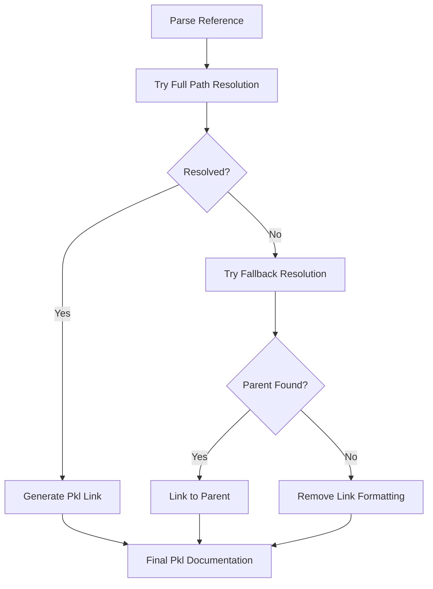

# Doc Comment Reference Resolution

This document describes the doc comment reference resolution system implemented in the [`PklSchemaRenderer`](../src/new_renderer.rs).

## Overview

The reference resolution system automatically converts Rust-style doc comment references into valid Pkl link syntax while handling name case transformations and providing fallback resolution for cases where specific members cannot be resolved.

## Features

### 1. Reference Patterns Supported

The system recognizes two main reference patterns from Rust documentation:

#### Rustdoc Style: `[`reference`]`
```rust
/// See [`MyStruct`] for details
/// Use [`Count::Two`] variant
/// Check [`Self::field`] property
```

#### Markdown Link Style: `[text](`reference`)`
```rust
/// See [the configuration](`Config`)
/// Use [this variant](`Count::Two`)
/// Check [this field](`Self::field`)
```

### 2. Reference Types

The system can resolve several types of references:

- **Type References**: `[`MyStruct`]` → `[MyStruct](MyStruct)`
- **Property References**: `[`MyStruct::field`]` → `[MyStruct::field](MyStruct.field)`
- **Self References**: `[`Self::field`]` → `[Self::field](ActualType.field)`
- **Enum Variant References**: `[`Count::Two`]` → `[Count::Two](Count)` (fallback)

### 3. Naming Conventions

The system applies Pkl naming conventions automatically:

- **Types**: Converted to `PascalCase`
- **Properties**: Converted to `camelCase`
- **References**: Use `.` notation instead of `::`

## Implementation Architecture

### Core Components

```rust
#[derive(Debug, Clone)]
struct ParsedReference {
    root: String,                    // The root type name
    path: Vec<String>,              // Path components after root
    is_self_reference: bool,        // Whether this was Self/self
}

#[derive(Debug, Clone)]
enum ResolvedReference {
    Type { name: String, schema: Schema },
    Property { type_name: String, property_name: String, field: SchemaField },
    FallbackToParent { parent_name: String, original_path: Vec<String> },
    Unresolved { original_text: String },
}
```

### Resolution Strategy

The system uses a hierarchical resolution strategy:



### Key Methods

#### `resolve_doc_references(&self, text: &str) -> String`
Main entry point that processes text and resolves all reference patterns.

#### `parse_reference_path(&self, reference: &str) -> ParsedReference`
Parses reference strings like "Count::Two" into structured components.

#### `resolve_reference_target(&self, parsed: &ParsedReference) -> ResolvedReference`
Attempts to resolve parsed references with fallback strategy.

#### `generate_pkl_link(&self, resolved: ResolvedReference, display_text: Option<&str>) -> String`
Generates final Pkl link syntax or plain text for unresolved references.

## Usage Examples

### Basic Type References

**Input:**
```rust
/// Configuration using [`DatabaseConfig`] settings
```

**Output:**
```pkl
/// Configuration using [DatabaseConfig](DatabaseConfig) settings
```

### Property References

**Input:**
```rust
/// The [`DatabaseConfig::host`] property specifies the server
```

**Output:**
```pkl
/// The [DatabaseConfig::host](DatabaseConfig.host) property specifies the server
```

### Self References

**Input:**
```rust
/// Use [`Self::validate`] to check this configuration
```

**Output:**
```pkl
/// Use [Self::validate](ActualConfigType.validate) to check this configuration
```

### Enum Variant Fallback

**Input:**
```rust
/// Set count to [`Count::Two`] for dual mode
```

**Output:**
```pkl
/// Set count to [Count::Two](Count) for dual mode
```

*Note: Since `Count::Two` becomes a literal `"two"` in the typealias, it can't be directly referenced, so we fall back to linking to the `Count` type.*

### Unresolved References

**Input:**
```rust
/// See [`NonExistentType`] for more info
```

**Output:**
```pkl
/// See NonExistentType for more info
```

*Note: Link formatting is removed but text content is preserved.*

## Error Handling & Fallback Strategy

### 1. Graceful Degradation
Unresolved references become plain text, ensuring the documentation remains readable.

### 2. Fallback Resolution
When specific members can't be resolved, the system falls back to parent types:
- `Count::Two` → `Count` (enum variant → enum type)
- `MyStruct::unknown_field` → `MyStruct` (if field doesn't exist)

### 3. Self/self Resolution
Always resolves `Self`/`self` to actual type names for clarity in the final Pkl output.

## Integration

### Comment Processing

The system integrates with the existing comment processing through:

```rust
impl CommentType {
    pub fn to_comment_with_resolver(&self, text: &str, indent: &str, resolver: &PklSchemaRenderer) -> String {
        let resolved_content = resolver.resolve_doc_references(text);
        self.to_comment(&resolved_content, indent)
    }
}
```

### Usage in Renderer

```rust
// In render_header()
if self.options.include_docs {
    if let Some(description) = self.schemas.get(&struct_name)
        .and_then(|s| s.description.as_ref()) {
        header.push_str(&CommentType::Doc.to_comment_with_resolver(
            description,
            &self.indent(),
            self
        ));
    }
}
```

## Testing

The system includes comprehensive tests covering:

- Reference parsing and validation
- Case transformation accuracy
- Fallback resolution for enum variants
- Self/self reference resolution
- Edge cases (empty references, malformed syntax)

### Test Files

- [`examples/reference_resolution_test.rs`](../examples/reference_resolution_test.rs) - Comprehensive test suite
- Unit tests embedded in the main implementation

## Configuration

Reference resolution is automatically enabled when `include_docs` is true in [`PklSchemaOptions`](../src/new_renderer.rs). No additional configuration is required.

## Future Enhancements

Potential improvements could include:

1. **Nested Property Resolution**: Support for deep property chains like `Config::database::host`
2. **Cross-Module References**: Support for references across different schema modules
3. **Custom Link Formats**: Configurable link generation for different documentation systems
4. **Reference Validation**: Optional warnings for completely unresolved references

## Performance Considerations

- Uses compiled regex patterns with `OnceLock` for efficiency
- Single-pass processing with regex replacements
- Minimal memory allocation through string reuse
- Lazy evaluation of complex resolution paths

## Compatibility

This system is designed to be:
- **Backward Compatible**: Existing documentation without references works unchanged
- **Pkl Compliant**: Generated links follow Pkl documentation conventions
- **Extensible**: Easy to add new reference patterns and resolution strategies
